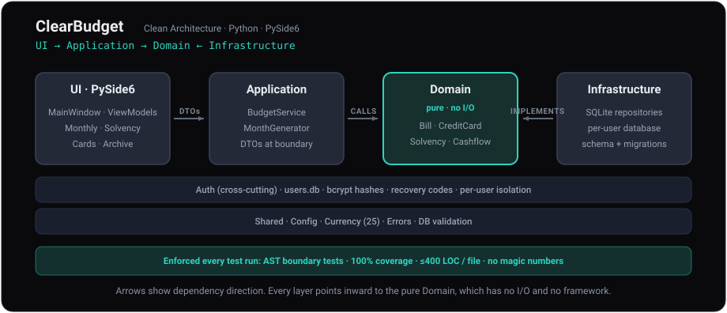

 [Clear Budget](https://ernster.dev/ClearBudget/)

# Clear Budget

**Personal Budgeting and Solvency Forecasting**

> **Most budgeting apps are retrospective ledgers that tell you where the money went. Clear Budget is forward-looking: it projects solvency for the months ahead and warns about mid-month overdrafts before they happen.**

A personal budgeting and solvency forecasting application for managing income, bills
and credit cards, with forward solvency analysis. Supports multiple user accounts with
secure authentication.

**Author:** Oliver Ernster  
**Licence:** GNU Lesser General Public Licence v3.0 (LGPL-3.0)

---

## Who it is for

- Anyone who needs to know whether the month holds together, not where last
  month's money went: the tightest day, the mid-month dip, the first month the
  balance goes under
- Households sharing one machine: each account gets its own isolated budget
  database behind a bcrypt sign-in; a snapshot can be handed to someone
  else as a read-only viewer package
- People who want their finances to stay on their own machine, offline, with no
  account to create and nothing phoning home. The one network request the app
  ever makes is a daily check of this project's GitHub releases for a newer
  version; it carries no data about you or your budget (see Update Checks
  below)

## Who it is not for

- Bookkeeping, invoicing, tax or double-entry accounting. There is no ledger,
  no reconciliation against a statement feed and no chart of accounts
- Bank connections. Clear Budget never contacts a bank, an aggregator or any
  server other than the GitHub update check described below; balances are
  entered and then maintained by the app itself
- Investments, assets, loans amortisation or net worth. It models a current
  account, its income, its bills and its credit cards; nothing else
- Shared or synchronised budgets across devices. There is no cloud, no sync and
  no multi-device story
- Encryption at rest. The sign-in is an access-control gate for the
  application, not protection of the files themselves (see Data Storage and
  Security below)

---

## Stack

| Concern | Choice |
|---------|--------|
| Language | Python 3.11+ |
| UI toolkit | PySide6 (Qt for Python), LGPL-3.0 |
| Storage | SQLite, one budget database per user plus a shared users database |
| Passwords | bcrypt hashes for passwords and recovery codes |
| Money | integer pence throughout; no floating point in any financial calculation |
| Architecture | four layers (Domain, Application, Infrastructure, UI), dependencies inward, enforced by AST structural tests |
| Tests | pytest with a 100% line and branch coverage gate; real implementations and hand-written fakes, no mock libraries |
| Quality | black (88 columns), flake8, ruff, a 400-line file limit |
| Windows packaging | PyInstaller plus a bespoke per-user setup program written in PySide6 |
| macOS packaging | `.dmg` disk image, signed and notarized; the build fails rather than produce an unnotarized release (a local-only escape hatch exists for development) |
| Linux packaging | Flatpak on the Freedesktop runtime |

---

## Architecture

<p align="center">
  
</p>

Clear Budget uses a clean, four-layer architecture with every dependency
pointing inward to a pure Domain that has no I/O and no framework. Layer
boundaries are enforced automatically by AST structural tests at every test
run. See [ARCHITECTURE.md](ARCHITECTURE.md) for the full design.

See [TECH_DEBT.md](TECH_DEBT.md) for the standing reference to what is still open,
what is deliberately left and what only looks like debt.

---

## Features

- Multi-user login with bcrypt password hashing and recovery codes
- Remember me on the sign-in screen: your username and password are prefilled
  at the next launch, with the password held in the operating system's own
  credential store (Windows Credential Manager, macOS Keychain, Linux Secret
  Service), never in a plain file; unticking the box forgets them immediately
- Create an account from the sign-in screen at any time, not just on first
  launch (only the very first account ever created is an admin)
- Read-only viewer accounts: export a snapshot of a budget as a "viewer
  package" for someone else to import and browse without editing
- Per-user isolated budget databases
- Month-by-month budget tracking with income and bill templates
- Per-bill monthly skip (exclude a bill from one month without deleting it)
- Per-bill end month: give a subscription or credit payment a final month, after
  which it stops; earlier months are untouched
- History-safe delete: removing a bill stops it from the viewed month onward and
  preserves earlier (and archived) months, with a separate "delete entirely"
  option for bills added by mistake
- Per-bill monthly overrides (amount and due day overrides for a specific month)
- One-off bills: "This month only" when adding a bill creates a bill scoped to
  just that month, mirroring one-off income entries
- Per-bill "paid" flag - excludes a paid bill from "still due" totals and the
  projected balance for the rest of the month
- Self-maintaining bank balance: dated bank bills are deducted from the balance
  at local midnight on their due day and dated income is added the same way;
  days that pass while the app is closed are caught up at the next launch and
  applied items tick their Paid/Received flags so nothing is counted twice
- Adding a bill or income dated today or editing an existing item's day to
  today, offers to apply it to the balance immediately (decline if your
  balance already reflects it)
- Deleting an item whose amount was applied automatically hands the amount
  back to the balance; manually setting the balance supersedes earlier
  automatic applications
- The balance edit dialog opens with the current figure selected, ready to
  type straight over
- Per-month income flexibility: per-month overrides, per-month skips, a
  "received" flag and "this month only" one-off income entries. An entry
  added as a one-off can be promoted to a regular income later
- Per-income start and end month: an income that has stopped names its final
  month rather than being deleted, so every month it really did arrive in
  keeps it. Deleting income offers the same two scopes bills have, stop from
  the viewed month or delete entirely
- Safe to Spend Today: the headline of the Solvency tab is the single number
  you could spend today while every month that still stands on its own keeps
  standing. It says how far that reaches and what limits it ("Holds every day
  through October above your £20.00 buffer; constrained by 14 Oct"). A month
  already under your buffer with nothing spent is a shortfall rather than a
  limit on today, so it does not veto the figure: it gets a line of its own
  naming the month, the amount and the fact that spending the headline
  deepens it. The window you set (one to twelve months, four by default)
  decides how far ahead the app looks, never how much it offers
- What you could spend if you wait: today is often the tightest day of the
  month, so beneath the headline a short schedule gives the figure from each
  later day money lands ("From 19 Aug: £108.04", "From 20 Aug: £443.31"),
  each naming the day still holding it down. Every line is measured across
  the same stretch the headline promises, so waiting never conjures money a
  later month needs back; a month whose figure never moves shows nothing rather than repeating
  the headline
- If the months ahead are like this one: beneath the known figures, a muted
  second reading says what the picture looks like if the income you entered
  for this month arrives again in every later month that has no entry of that
  name. Months ahead usually look poorer than they are simply because their
  ad hoc income has not been typed in yet, so a reading that counts only what
  is typed reports a shortfall you do not have. The assumption is derived,
  not marked by hand, so the block appears on its own once the months ahead
  are thinner than this one; every line says it depends on money not yet
  received and names exactly what has to arrive, plus when
- What a month needs to hold flat: every month on the Solvency tab states the
  difference between its full bills and its full income ("October needs
  £666.87 more to hold flat" or "September pays for itself, £120.00 to
  spare"). Whole-month arithmetic on both sides, so the answer describes the
  shape of the month rather than how far through it you are and does not move
  as the month elapses. A month can close in credit while still running at a
  loss, which is exactly what a closing balance alone hides
- Credit card interest is reported beside that figure, never inside it: it
  accrues on the cards and never leaves the bank account, so adding the two
  together would claim money that was never going to move
- User-editable Safe to Spend buffer (a reserve the number always leaves in
  hand, £20 by default; set it to zero to plan to the wire) and a window: how
  many months the figure must keep standing, one to twelve, four by default
  (Settings > Bank Account). A longer window is a stricter question, so it
  usually returns a smaller number
- Solvency analysis with forward cashflow projections (next 2 months)
- Runway warnings: a deficit month shows how fast savings are falling per month
  and the first month you would go overdrawn (a mid-month dip counts even when the
  month closes positive); going overdrawn with no facility is flagged as a stark
  clarion on the forward projection
- Mid-month overdraft detection (accounts for bills clustering before late income)
- Configurable bank overdraft facility (limit + APR) with a Monthly Budget
  warning when the projected balance dips below zero mid-month, even if the
  month ends positive
- Credit card management: limits, interest rates, payment due dates, utilisation tracking
- Per-card monthly cashflow breakdown (charges, payment, interest, minimum due, projected closing balance)
- Live pro-rated credit card balance projection between months
- 6-month rolling balance projection per card (colour-coded by available headroom)
- Scheduled credit-limit changes: record dated future changes to a card's limit;
  projections look ahead with the right limit and each change folds in
  automatically once its date passes
- Dynamic payment methods: assign bills to bank account or specific credit cards
- Database save to a remembered location and validated load (File menu and the
  folder/diskette buttons at the far left of every tab's navigation tray, with
  cog and bank buttons beside them for Preferences and Bank Account and a blue
  information button at the far right opening How It Works)
- Display currency selection - 25 currencies covering English-speaking countries (Settings > Preferences)
- Month graphs: the icon in the navigation tray opens the viewed month as a
  bar or line graph (a pilot button switches the style); Monthly Budget plots
  the bank balance day by day, Credit Cards plots every card on one chart.
  Previous/Next buttons inside the graph step it between months without
  closing it, stopping at the same earliest month the tray does; hovering a
  bar or a marked point reads out that day's balance; any day the balance
  sits below zero paints in red, on screen and in the export alike
- Export the graph as a single HTML file: one page carrying both the bar and
  the line rendering with text explaining what each shows. On Monthly Budget
  a second export takes a range of months and charts your bank balance across
  them, month end against the lowest point reached inside each month, with a
  table and a traffic light per month. Both files are self-contained (inline
  styles, inline SVG) in the dark theme, so they can be emailed and opened
  offline and both default to your Downloads folder
- Full keyboard navigation: Tab or Right steps forward, Shift+Tab or Left
  steps back (wrapping); Up/Down walk table rows; Enter equals Space; focus
  and hover show a green ring, disabled controls a red one; nothing is focused
  on launch until the first keypress
- The tab strip is walked tab by tab in the order shown and marking a tab
  never switches to it: Enter or Space does that. The tab you are already
  reading is skipped
- The page itself is the last stop on each tab whenever it has more content
  than fits, so Up/Down, Page Up/Down and Home/End scroll it from the keyboard
- Dark and light themes: a sun/moon button at the far right of the navigation
  tray on every tab switches between them, the whole app restyles immediately
  (the sign-in screen included) and the choice is remembered between sessions
- Scrollable tabs with scroll position indicators; a consistent, centred
  month/year navigation tray on every tab, with the date colour-coded by
  financial health (green/amber/red)
- Opens on the monitor you started it from, centred, rather than on whichever
  display the system calls primary; dialogs open over the window that raised
  them, focused on their first usable control
- Built-in "How It Works" help screen explaining the concepts (pro-rating,
  the self-maintaining balance, Safe to Spend Today, archiving), not a
  button-by-button inventory
- SQLite storage: per-user budget database + shared users database

---

## Application Tabs

- **Monthly Budget** - View and manage bills and income for the selected month; toggle active/skip/paid per bill and received per income; view balance (kept up to date automatically as dated items fall due) or projected end-of-month figure; mid-month overdraft dip warning; hint linking to the Solvency tab
- **Solvency** - Safe to Spend Today headline, financial health analysis, overdraft alerts, mid-month cashflow risk, per-card utilisation bars, forward projections for the next two months. Every month on the page states its low point and the day it falls on, plus what it needs to hold flat, in one shape, whether or not that month is in trouble, including when the low lands on a bill day rather than a payday
- **Credit Cards** - Scrollable list of per-card panels (active toggle, status badge, overview and this-month figures, Edit/Delete); month-navigation shows projected closing balances for future months; 6-month projection strip
- **Archive** - Historical month summaries by year with navigation; drill down into individual months (only fully-completed months are shown). Months are archived automatically as they end (there is no manual archive step); opening the app records any month that has passed since it was last launched

---

## Menus

| Menu | Action | Description |
|------|--------|-------------|
| File | New Budget... | Wipe all budget data and start fresh (double confirmation required) |
| File | Load... | Replace active database from a saved file (validated before write) |
| File | Save | Copy the database to the remembered save file; the first save prompts for a filename, defaulting to Downloads |
| File | Save As... | Choose a new save file; the location is remembered between runs |
| File | Import / Export > Export Read-Only Viewer Package... (admin only) | Bundle a snapshot of the budget into a zip for a viewer account |
| File | Import / Export > Import Read-Only Viewer Package... (admin only) | Import a viewer package, creating or refreshing a read-only account |
| File | Exit | Close application |
| Settings | Preferences... | Choose display currency |
| Settings | Bank Account | Configure an overdraft facility (limit and APR) plus the Safe to Spend Today buffer and window |
| Users | Switch User | Return to login screen |
| Users | Manage Users... (admin only) | Add and remove accounts (see User Accounts below) |

Load, Save, Preferences and Bank Account are also one click away in every
tab's navigation tray: the folder and diskette buttons sit at its far left,
then a separator, then the cog (Preferences) and the bank. At the far right,
after the theme toggle, a blue information button opens How It Works.

Read-only viewer accounts have most of these actions disabled and the window title
shows "(Read-only)".

---

## User Accounts

On first launch, a setup wizard creates an admin account - the only account that is
ever an admin. A one-time recovery code is displayed and must be acknowledged before
the wizard completes.

Subsequent launches show a login screen with username/password fields plus:
- **Remember me** - prefill these credentials at the next launch. The password
  goes into the operating system's credential store, not a file; untick the box
  and the stored credentials are forgotten immediately
- **Forgot password?** - reset using the recovery code
- **Import Viewer Package...** - import a read-only viewer account from a package file
- **Create Account...** - create a new (non-admin) account at any time, without
  needing an admin

The **Users** menu offers Switch User to every account; for admins it also
carries **Manage Users...** for adding and removing accounts (added
accounts are also non-admin). Admins cannot delete their own account. Deleting a user
account always permanently deletes that user's budget data too (two confirmations
required) - there is no way to keep an orphaned data file after the account's
credentials are destroyed. Non-admin users see only Switch User in the Users menu.

A **read-only viewer account** can sign in to browse a snapshot of someone else's
budget but cannot edit anything.

---

## Data Storage and Security

Clear Budget is a local-first desktop application. All data lives on your own
machine under `~/.clearbudget/`:

- `users.db` - account records. Passwords and recovery codes are stored only as
  bcrypt hashes, never in plain text.
- `budget_<username>.db` - one separate database per user. Accounts cannot read
  each other's budget data through the application.
- `ui_settings.json` - the chosen theme, the remembered save-file location and
  any release version you told the update prompt to skip, so the app opens the
  way you left it and Save goes back to the same file. No budget data is kept
  here.
- `remembered_login.json` - present only while Remember me is ticked: the
  username whose password is being remembered, so the app knows which
  credential-store entry to look up. The password itself is never in this file;
  it lives in the operating system's credential store (Windows Credential
  Manager, macOS Keychain, Linux Secret Service), encrypted and managed by the
  OS. Unticking Remember me deletes both the file and the credential-store
  entry.

Installing, upgrading, repairing and uninstalling do not touch any of this.
They deal in program files, shortcuts and the registry entry only, so
reinstalling picks up where you left off, saved theme included. Uninstall
deliberately offers no option to delete the directory: to remove your data,
delete `~/.clearbudget` yourself.

All amounts are held as integer pence. No financial figure in the application
is ever a floating-point number, so nothing rounds away between the value you
type and the value a projection uses.

**What the login protects and what it does not.** The username/password sign-in
is an access-control gate for the application: it stops another person who shares
your computer from opening the app and casually reading or editing your budget.
That is the threat it is designed to stop and the only one.

The database files themselves are **not encrypted at rest**. A technically
capable person with read access to your user folder can open
`budget_<username>.db` directly with any SQLite tool and read its contents
without going through Clear Budget at all. The bcrypt login does not prevent
this and is not intended to. For the common case - keeping a housemate, family
member or colleague from idly browsing your finances inside the app - this is
the right level of protection. If your threat model includes a determined local
attacker, protect the files at rest with your operating system's own encryption
(BitLocker on Windows, FileVault on macOS, LUKS on Linux).

---

## Update Checks

The update check is the only network request Clear Budget ever makes. Shortly
after launch, then once a day while running, the app asks GitHub's public
releases API whether a newer version of Clear Budget has been published. The
request carries nothing about you, your machine or your budget; it is a plain
read of `api.github.com/repos/oernster/ClearBudget/releases/latest`.

Only a formally published release can trigger the prompt: drafts, prereleases
and bare tags are invisible to that endpoint. When a newer release exists, a
dialog offers the download for your platform (the Windows installer, the macOS
DMG or the Linux flatpak), a Skip This Version option that silences that
release for good and Later. A failed check is silent; nothing retries in the
background. Help > Check for Updates runs the same check on demand and also
reports when you are already up to date.

---

## Display Currency

Settings > Preferences opens a currency picker. 25 currencies are supported:

GBP, USD, EUR, AUD, CAD, NZD, ZAR, SGD, HKD, INR, NGN, GHS, KES, PHP, PKR, BDT,
JMD, TTD, NAD, BWP, ZMW, BZD, GYD, FJD, PGK

The selection is saved per user and takes effect immediately throughout the app.
Defaults to GBP.

---

## Bill Categories

- `housing` - Rent, mortgage
- `utilities` - Electric, water, internet
- `subscriptions` - Recurring services
- `credit_payment` - Credit card payments
- `groceries` - Food and household
- `discretionary` - Entertainment, leisure and one-off purchases

For a genuinely one-off expense, tick "This month only" when adding the bill;
the retired `one_time` category is recategorised to `discretionary`
automatically (archived months keep their historical label).

---

## Payment Methods

Each bill is assigned to either:
- **Bank Account** (default) - deducted from bank balance
- **Credit Card** - tracked separately, affects card utilisation

---

## Credit Card Tracking

For each card:
- Credit limit and current balance used (live pro-rated between months)
- Scheduled future credit-limit changes (dated; folded in automatically when due)
- Interest rate (APR) or minimum payment percentage (per-card calibrated)
- Payment due day
- Card expiry date
- Active/inactive status

The Credit Cards tab shows each card as its own panel: active checkbox, name, status
badge, an overview row (limit/used/available/utilisation/due day/interest/minimum
payment/expiry) and a this-month row (charges/payment received/interest/minimum
payment due). Edits go through the Edit Card dialog; cards are deleted individually
with confirmation.

Utilisation thresholds in projection views:
- Green: available headroom > 250 (in active currency)
- Amber: available headroom <= 250
- Red: available headroom <= 100

---

## Monthly Skip / Override

Bills can be skipped or overridden for a single month without affecting other months
or the bill template:
- **Skip**: bill excluded from that month's totals; shown greyed with "(skipped this month)"
- **Override**: amount and/or due day changed for one month; shown with blue `(*)` indicator
- **Paid**: bill marked as paid for the month is excluded from "still due" totals and
  the projected balance for the rest of that month, since the money has already left
  the account. Ticked automatically when a dated bank bill is applied to the
  balance at midnight on its due day

Income sources have the same per-month flexibility (overrides, skips and a "received"
flag that likewise ticks itself when a dated income is applied to the balance), plus
"this month only" one-off entries for ad-hoc income not tied to a recurring template.
A one-off can be promoted to a regular income later; the reverse is deliberately
not offered, because turning a regular income into a one-off would delete it from
the months it really did arrive in.

A bill can also **change amount from a month onward**, which is what a rent
increase is: say what it costs from a given month and that amount applies to
that month and every month after it. Months before it keep the amount they
actually had, so a report run for an earlier month still says what was really
paid. A change is never retrospective. This is different from a single-month
override, which says one month differed rather than that the cost has moved;
where both apply to the same month, the override wins and the month after
returns to the new standing amount.

Beyond single-month tweaks, a bill can be given an **end month** so it stops after
that month; deleting a bill offers two scopes: **stop from the viewed month**
(the viewed month onward drop it while earlier and archived months keep it) or
**delete entirely** (removed from every month). The first is the history-safe way
to end something; the second is for entries added by mistake.

Income works the same way on both counts. An income carries a **start month** and
an **end month**, so one that has stopped names its final month instead of being
erased; deleting income offers the same two scopes. Both bounds are optional:
an income that states neither appears in every month, which is what every income
entered before these existed continues to do.

---

## Database Save / Load

- **Save** (File > Save or the diskette button in every tab's nav tray): copies
  the active database to the remembered save file, asking before overwriting it.
  The first ever save prompts for a filename, defaulting to the Downloads
  folder; the chosen location is remembered between runs
- **Save As** (File > Save As...): choose a new save file (`.db` extension
  enforced); becomes the remembered location for future saves
- **Load** (File > Load... or the folder button beside the diskette): file
  validated as SQLite and verified to contain all required Clear Budget tables
  and columns before any write; confirmation required if active database has
  data; window reloads automatically after load - no restart needed

---

## Solvency Panel

- **Safe to Spend Today**: the headline number, the most you could spend
  today while every month that currently survives still survives (buffer £20
  by default, editable in Settings > Bank Account, zero if you want to plan
  to the wire). A spend today lowers every later day, so the figure is
  measured across whole months rather than to the end of this one, bounded by
  the last month that clears the buffer with nothing spent. That bound is the
  promise, stated in full: "Holds every day through October above your
  £20.00 buffer; constrained by 14 Oct". A month beyond it that cannot be
  saved by spending nothing is named on a second line with its shortfall and
  a plain statement that spending the headline deepens it, so neither fact is
  hidden by the other. "Nothing safe to spend" now means what it says: not
  even this month clears the buffer; the figure shown is then the sum to FIND
- **If you wait**: the same figure from each later day of the month, one line
  per change, so an income landing on the 20th has a number against it
  instead of leaving you to guess. Each line names the day still holding the
  figure down, which is often in a LATER month: that is the point of it, since
  a bigger balance later this month does not mean a bigger balance to spend
  when September has to survive too
- **If the months ahead are like this one**: a muted second reading of the
  same figures, run on the assumption that income entered for this month
  arrives again in any later month with no entry of that name. It carries the
  same traffic-light hues blended toward the background, so it reads as
  provisional at a glance. It always names what must arrive for it to come
  true. Counterintuitively the assumed figure is often LOWER than the
  known one, because making a later month survive extends how far the
  question reaches; the panel says so rather than leaving it to look like a
  fault
- **What the month needs**: the gap between the month's full bank bills and
  its full income, stated for every month the page shows. Credit card interest
  is reported on its own line beneath it and is never added in, because it
  accrues on the cards rather than leaving the bank account
- **Overdraft alert**: SAFE / AT RISK / CAUTION / CRITICAL based on projected
  balance; a deficit month names how fast savings are falling per month and the
  first month you would go overdrawn; it also flags "no overdraft facility" when
  you have none
- **Mid-month alert**: detects temporary overdraft when bills cluster before the last income payment of the month
- **Credit Card Status**: one progress bar per card showing current balance vs limit; projected month-end closing balance, charges, payment, interest, minimum due and net direction all shown inline
- **Forward Projection**: day-by-day cashflow narrative for the next two months
  including card state, each stating that month's low point and the day it
  falls on plus what it needs to hold flat; a dip within an agreed overdraft
  reads calmly, while going
  overdrawn with no facility (or beyond it) is rendered as a stark clarion

The Monthly Budget tab also links here via "See the Solvency tab for full balance
projections."

---

## Bank Account

Settings > Bank Account (or the bank button in the navigation tray) opens a
dialog to record an overdraft facility: a limit
(in the active currency) and an APR. With a facility recorded, the Monthly Budget tab
shows:
- An amber warning if the projected balance dips below zero but stays within the
  facility, including an estimated daily interest cost
- A red warning if the dip would exceed the facility or if no facility is set at all

The same dialog holds the Safe to Spend Today settings: the buffer (a balance
the number will never plan to go below, £20 by default; an explicit zero
plans to the wire) and the window, how many months the figure has to keep
standing (one to twelve, four by default).

---

## Help Menu

- **About Clear Budget** - version, author and the open source credits, split
  into what is bundled with the application and what is only used to build it
- **Check for Updates** - queries this project's GitHub releases and reports
  whether a newer version exists, offering the download for your platform
- **How It Works** - plain-English explanation of the concepts the screens
  cannot say for themselves (pro-rating, the self-maintaining balance, Safe
  to Spend Today, archiving, viewer packages), kept in sync with the
  calculation logic
- **View Licence (LGPL-3.0)**

---

## Installing

Every release ships one native package per platform, from
[the releases page](https://github.com/oernster/ClearBudget/releases/latest).
The asset names carry no version, so a link to the latest release never goes
stale.

| Platform | Download | Install | Run |
|----------|----------|---------|-----|
| Windows 10/11, 64-bit | `ClearBudgetSetup.exe` | Run it. The install is per-user, so no administrator rights are needed. Run the same file again later to upgrade, repair or uninstall | Start menu or desktop shortcut; or tick "Launch Clear Budget when setup finishes" |
| macOS (Apple Silicon) | `clearbudget.dmg` | Open the disk image and drag Clear Budget into Applications | Launchpad or Applications |
| Linux (any distribution with Flatpak) | `clearbudget.flatpak` | `flatpak install --user clearbudget.flatpak` | `flatpak run com.oliverernster.clearbudget` |

On Windows, if Clear Budget is running when you install, upgrade, repair or
uninstall, setup offers to close it and says plainly that the running session
ends, then waits for the file lock to release before carrying on. If the
application will not close, setup stops and says so rather than failing part
way through.

Two absences are deliberate. Uninstall offers **no** "remove my user data"
option: `~/.clearbudget` holds every account and every user's budget on the
machine and deleting it cannot be undone, so it is left for you to do by hand
(`tests/structural/test_data_dir_isolation.py` fails if any installer module so
much as names the directory). And there is **no** launch-on-sign-in entry,
because Clear Budget has no such feature and a setup switch for one would be a
product decision rather than a packaging one.

## Running from source

```
python main.py
```

## Requirements

- Python 3.11+
- PySide6 >= 6.8.0
- bcrypt
- keyring

## Tests

```
pytest -v --cov
```

The gate is 100% line and branch coverage over `clear_budget`, `main` and the
Qt-free half of the setup program. A coverage-gated run prints the coverage
table last and emits no "N passed" line, so read the exit code: `0` means the
tests passed AND the gate was met. See
[DEVELOPMENT-README.md](DEVELOPMENT-README.md) for what sits outside the gate.

---

## Building from source

To set up a development environment or build an installable package on Linux
(Flatpak), macOS (.dmg) or Windows (installer), see
[DEVELOPMENT-README.md](DEVELOPMENT-README.md).

---

## Licence

Distributed under the GNU Lesser General Public Licence v3.0.  
See Help > View Licence in the application or visit https://www.gnu.org/licenses/lgpl-3.0.html

### Open Source Credits

Bundled with the application, so their licences travel with it:

- **Python** - Python Software Foundation (PSF Licence)
- **PySide6 (Qt for Python)** - The Qt Company (LGPL-3.0)
- **Shiboken6** - The Qt Company; the binding runtime PySide6 is built on (LGPL-3.0)
- **SQLite** - Public Domain
- **OpenSSL** - The OpenSSL Project Authors; the cryptographic libraries Python
  links against (Apache-2.0)
- **libffi** - Anthony Green and contributors (MIT-style licence)
- **bcrypt** - Nate Lawson, Perry Metzger (Apache-2.0)
- **keyring** - Jason R. Coombs and contributors (MIT); stores the remembered
  sign-in in the OS credential store
- **pywin32** - Mark Hammond (PSF Licence); Windows only, where it is actually shipped
- **pywin32-ctypes** - Enthought, Inc. (BSD-style); Windows only, keyring's
  Credential Manager binding
- **SecretStorage**, **Jeepney** and **cryptography** - Linux only, keyring's
  Secret Service stack (BSD-3-Clause, MIT and Apache-2.0/BSD-3-Clause)

Used to build and test it, not shipped but no less owed:

- **PyInstaller** - PyInstaller contributors (GPL-2.0 + bootloader exception)
- **Pillow** - Jeffrey A. Clark and contributors; builds the application icons (HPND)
- **pytest**, **pytest-qt**, **pytest-cov** (MIT) and **coverage.py** (Apache-2.0)
- **black** - Lukasz Langa et al. (MIT)
- **Flake8** - Tarek Ziade, Ian Stapleton Cordasco and contributors (MIT)
- **Ruff** - Astral Software Inc. (MIT)

The same two lists appear in Help > About, which is the copy checked against
what the build actually bundles.
