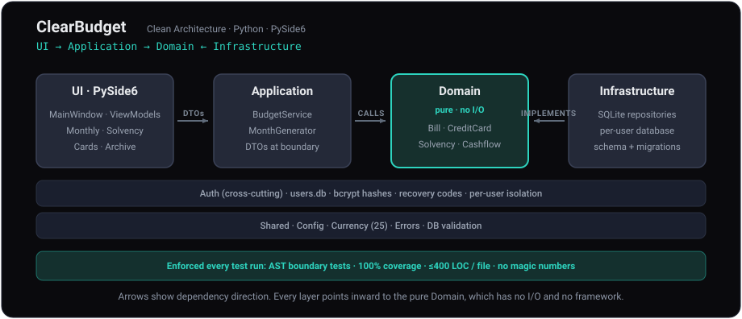

 [ClearBudget](https://clearbudget.co.uk/)

# ClearBudget

A personal budgeting and solvency forecasting desktop application. Most
budgeting apps are ledgers that tell you where last month's money went.
ClearBudget looks forward instead: it projects the months ahead day by day,
says what you can safely spend today and warns about a mid-month overdraft
before it happens. It manages income, bills, credit cards and money set aside
for future bills, for one or several accounts on the same machine, with all
data kept locally.

> **Commercial licences available.** ClearBudget is free and open source under
> the GNU Lesser General Public Licence v3.0 (LGPL-3.0). If those terms do not
> suit what you are building, a commercial licence can be bought from me
> separately. It covers my own code; PySide6 (LGPL-3.0) keeps its own terms.
> See [commercial licensing](https://ernster.dev/commercial-licensing.html).

## Who it is for

- Anyone who needs to know whether the month holds together: the tightest
  day, the mid-month dip, the first month the balance goes under
- Households sharing one computer: each account has its own budget databases
  behind a bcrypt sign-in
- People who want their finances to stay on their own machine, with no online
  account to create

## Who it is not for

- Bookkeeping, invoicing, tax or double-entry accounting. There is no ledger
  and no reconciliation against a statement feed
- Bank connections. Balances are entered by hand and then maintained by the
  app; it never contacts a bank or an aggregator
- Investments, loans or net worth. It models a current account, its income,
  its bills and its credit cards
- Shared or synchronised budgets. There is no cloud and no sync
- Encryption at rest. The sign-in is an access-control gate for the
  application, not protection of the files themselves

## Capabilities

### Budgeting

- Month-by-month bills and income built from templates
- Per-month skip, amount and due-day overrides for any bill or income
- One-off "this month only" bills and income; a one-off income can later be
  promoted to a regular one
- Start and end months for income, end months for bills, plus amount changes
  that apply from a given month onward without rewriting earlier months
- Two delete scopes: stop from the viewed month (history kept) or delete
  entirely
- Paid and received flags, so money that has already moved is never counted
  twice
- A self-maintaining bank balance: dated items are applied at local midnight
  on their day and missed days are caught up at the next launch
- Bills assigned to the bank account or to a specific credit card
- Six bill categories and a choice of 25 display currencies (GBP by default)
- Click any column heading to order the bills, income, Reserves or Archive
  tables by it

### Solvency and forecasting

- A Solvency view with two pages: one built only from what you have entered,
  one that assumes this month's income repeats in later months with no entry
  of that name
- Every month on the bank page leads with how far it goes overdrawn and when,
  plus its deepest point where that is worse ("Overdrawn by £200.00 on day 21,
  at worst £500.00 on day 25"); a clean month reads "Never overdrawn"
- Each of the next two months states what would keep it afloat and the day it
  must arrive by, measured against any arranged overdraft
- The month on screen states what it needs to hold flat (full bills plus
  reserves against full income); card interest is shown beside it, never
  inside it
- Safe to Spend Today: the most you can spend now while every month in the
  window keeps above your buffer, with a schedule of what waiting for later
  income would allow
- Configurable buffer (£20 by default) and window (one to twelve months, four
  by default)
- Overdraft facility (limit and APR) with amber and red warnings for a
  mid-month dip, even in a month that closes positive

### Reserves, recommendations and graphs

- Reserves: name a future bill (an annual premium, an MOT, Christmas) and its
  cost is accrued across the months before it, so no view offers that money as
  spendable. Nothing is moved between accounts
- Recommendations: measured suggestions for retiming bills and income,
  per-month income asks and priced reserve pauses. There is no Apply button;
  each suggestion has a try-it-on checkbox that shows its effect without
  changing anything
- A "cannot be moved" tick keeps a fixed payment day out of Recommendations
- Graph: the month's bank balance or every card, as bars or lines, coloured
  against your arranged overdraft
- Export the graph as one self-contained HTML file or a range of months as a
  linked folder, saved to Downloads by default with nothing fetched from the
  network

### Credit cards

- Limits, APR or minimum payment percentage, due day, expiry and an active
  toggle per card
- Per-card monthly cashflow (charges, payment, interest, minimum due) and a
  six-month balance projection coloured by headroom
- Scheduled future credit-limit changes that apply themselves when due

### Accounts and data

- Multiple accounts with bcrypt-hashed passwords and a one-time recovery code;
  the first account created is the only admin
- Remember my username and Remember my password per account; the password is
  held in the operating system's credential store via keyring, never in a file
- Several named budgets per account, each its own SQLite database (File > New
  Budget, Switch Budget)
- Save, Save As and validated Load of the active budget; the save location is
  remembered per account
- Back Up Everything and Restore Everything (admin only): every account and
  budget in one zip, validated before any live file is replaced
- An account name that would share another account's budget file is refused;
  orphaned budget files are moved to a `quarantine` folder, never deleted
- Completed months are archived automatically and shown by year in the Archive
  view
- All money is held as integer pence; an amount finer than a penny is refused
  rather than rounded

### Interface

- Seven views: Monthly Budget, Solvency, Credit Cards, Reserves, Graph,
  Recommendations and Archive
- Full keyboard navigation: Tab or Left/Right move focus, Up/Down walk table
  rows, Enter and Space activate
- Dark and light themes, remembered between sessions
- A single running copy: a second launch brings the existing window forward
- Help > How It Works names every icon and states the rules behind the numbers

### Local data and the network

Data lives in `%LOCALAPPDATA%\ClearBudget` on Windows,
`~/Library/Application Support/ClearBudget` on macOS and
`~/.var/app/com.oliverernster.clearbudget/data/clearbudget` in the Linux
Flatpak. Installing, upgrading and uninstalling never touch it; to remove your
data, delete that directory yourself.

The database files are not encrypted. Anyone with read access to your user
folder can open them with an SQLite tool. If that matters, use your operating
system's disk encryption (BitLocker, FileVault or LUKS). The full backup zip
is equally unencrypted.

The only connection the app opens itself is the update check: shortly after
launch and then once a day, it reads
`api.github.com/repos/oernster/ClearBudget/releases/latest`. It sends no
account or budget data. A failed check is silent. The donate button and an
offered update download open your web browser; the app itself sends nothing.

For the reasoning behind these choices see
[DECISIONS-TRADEOFFS.md](DECISIONS-TRADEOFFS.md). Open and deliberately
deferred work is in [TECH_DEBT.md](TECH_DEBT.md).

## Stack

| Concern | Choice |
|---------|--------|
| Language | Python 3.11+ |
| UI toolkit | PySide6 (Qt for Python) |
| Storage | SQLite: a shared users database plus one database per budget |
| Passwords | bcrypt; remembered passwords via keyring |
| Money | integer pence; no floating point in financial calculations |
| Architecture | four layers (Domain, Application, Infrastructure, UI), dependencies inward, enforced by AST structural tests |
| Tests | pytest with a 100% line and branch coverage gate over the non-UI code; hand-written fakes, no mock libraries |
| Quality | black and ruff (88 columns), flake8, a 400-line file limit |
| Windows packaging | PyInstaller plus a per-user setup program written in PySide6 |
| macOS packaging | signed and notarised `.dmg` |
| Linux packaging | Flatpak on the Freedesktop runtime |

<p align="center">
  
</p>

See [ARCHITECTURE.md](ARCHITECTURE.md) for the full design.

## Install and run

Download the package for your platform from
[the releases page](https://github.com/oernster/ClearBudget/releases/latest).

| Platform | Download | Install | Run |
|----------|----------|---------|-----|
| Windows | `ClearBudgetSetup.exe` | Run it; the install is per-user, so no administrator rights are needed. Run it again to upgrade, repair or uninstall | Start menu or desktop shortcut |
| macOS | `clearbudget.dmg` | Drag ClearBudget into Applications | Launchpad or Applications |
| Linux (Flatpak) | `clearbudget.flatpak` | `flatpak install --user clearbudget.flatpak` | `flatpak run com.oliverernster.clearbudget` |

To run from source:

```
pip install -r requirements.txt
python main.py
```

## Tests

```
pytest
```

Read the exit code: `0` means the tests passed and the coverage gate was met.
See [TESTING.md](TESTING.md).

## Building

To set up a development environment or build the Windows installer, the macOS
`.dmg` or the Flatpak, see [DEVELOPMENT.md](DEVELOPMENT.md).

## Supporting the project

ClearBudget is free and stays free. There is no paid tier, no licence key and
nothing held back behind a donation. If it is useful to you, a donation
supports maintenance and further development.

<a href="https://www.paypal.com/ncp/payment/S6BW7C69J8SLQ"></a>

## Licence

Distributed under the GNU Lesser General Public Licence v3.0. See
[LICENSE](LICENSE), Help > View Licence in the application or
https://www.gnu.org/licenses/lgpl-3.0.html.

### Open Source Credits

Bundled with the application:

- **Python**: Python Software Foundation (PSF Licence)
- **PySide6 and Shiboken6**: The Qt Company (LGPL-3.0)
- **SQLite**: public domain
- **OpenSSL** (Apache-2.0) and **libffi** (MIT-style), linked by Python
- **bcrypt** (Apache-2.0) and **keyring** (MIT)
- Windows only: **pywin32** (PSF Licence) and **pywin32-ctypes** (BSD-style)
- Linux only: **SecretStorage** (BSD-3-Clause), **Jeepney** (MIT) and
  **cryptography** (Apache-2.0 or BSD-3-Clause)

Used to build and test, not shipped: **PyInstaller** (GPL-2.0 with bootloader
exception), **Pillow** (HPND), **pytest** and **pytest-cov** (MIT),
**coverage.py** (Apache-2.0), **black**, **Flake8** and **Ruff** (MIT).

Help > About carries the same lists.

A commercial licence for my own code is also available: see
[commercial licensing](https://ernster.dev/commercial-licensing.html).
